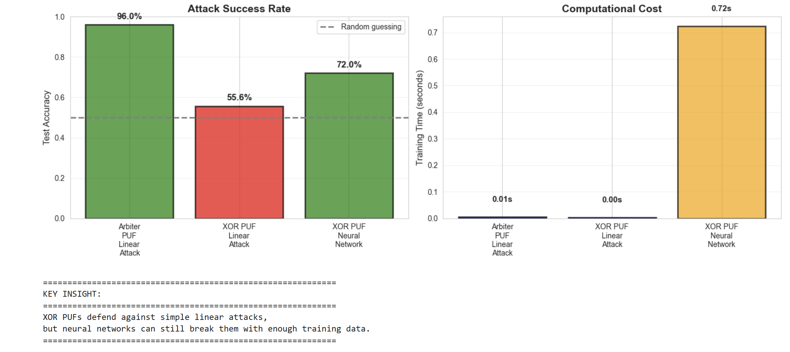
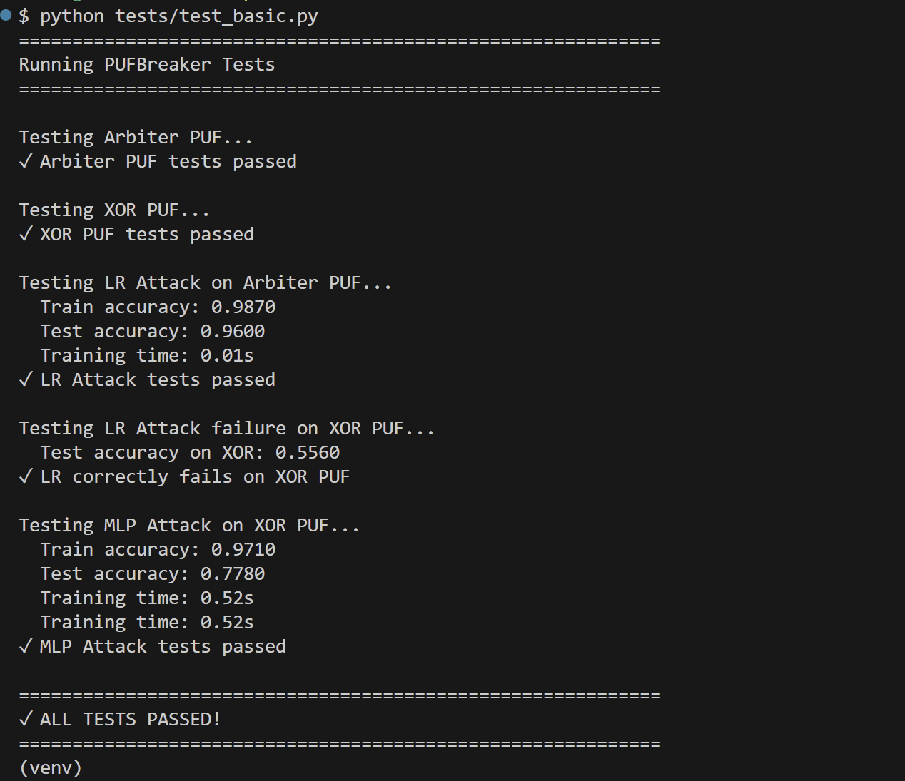

# PUFBreaker: ML security analysis for physical unclonable functions (PUF)

A Python library for simulating Physical Unclonable Functions (PUFs) and demonstrating machine learning attacks against them.

## what is this?

**Physical Unclonable Functions (PUFs)** are hardware security primitives used for device authentication. They exploit manufacturing variations to create unique "fingerprints" for each chip.

**this library shows**: Machine learning can break these security mechanisms

**Key discovery implemented**: 
- Simple PUFs → broken by **linear models** (95%+ accuracy)
- XOR PUFs → require **neural networks** (80%+ accuracy)

## Quick start

### Installation

```bash
# clone the repository
git clone https://github.com/AnvithaCodes/pufbreaker.git
cd pufbreaker

# install dependencies
pip install numpy scikit-learn matplotlib seaborn jupyter

# install the package
pip install -e .
```

### Demo

```python
from pufbreaker import ArbiterPUF, LRAttack

# create a PUF
puf = ArbiterPUF(n_stages=64, seed=42)

# generate training data
X_train, y_train = puf.generate_dataset(1000)
X_test, y_test = puf.generate_dataset(500, seed=999)

# attack it!
attack = LRAttack()
attack.fit(X_train, y_train)

print(f"Attack accuracy: {attack.score(X_test, y_test):.1%}")
# Output: Attack accuracy: 96.0%
```

## Results

The experiments demonstrate the security landscape of PUFs:

| PUF Type | Attack Type | Accuracy | Training Time |
|----------|-------------|----------|---------------|
| Arbiter PUF | Logistic Regression | **96.0%** | 0.01s |
| XOR PUF (k=2) | Logistic Regression | **55.6%** | 0.01s |
| XOR PUF (k=2) | Neural Network | **77.8%** | 0.52s |

**Key Insight**: XOR significantly increases security by forcing attackers to use sophisticated neural networks instead of simple linear models.

## Interactive demo

check out this Jupyter notebook demo:

```bash
cd examples/notebooks
jupyter notebook demo.ipynb
```

The demo shows:
1. How linear attacks easily break Arbiter PUFs
2. Why linear attacks fail on XOR PUFs  
3. How neural networks can still succeed

## Architecture

```
pufbreaker/
├── pufbreaker/           # Core library
│   ├── arbiter_puf.py    # Simple delay-based PUF
│   ├── xor_puf.py        # XOR of multiple Arbiters
│   ├── lr_attack.py      # Logistic regression attack
│   ├── mlp_attack.py     # Neural network attack
│   └── utils.py          # Feature transformations
├── examples/
│   └── notebooks/        # Interactive demos
├── tests/                # Unit tests
└── README.md
```

## How it works

### Arbiter PUF
- Two parallel delay chains race against each other
- Challenge bits control crossing/straight paths
- Response = which signal arrives first
- **Vulnerability**: Linear relationship → easily modeled

### XOR PUF
- XORs outputs from k parallel Arbiter PUFs
- Introduces non-linearity to defense
- **Security**: Resists linear attacks, but vulnerable to neural networks

### The attacks

**Logistic Regression (Linear)**
- Fast training (~0.01s)
- Works perfectly on Arbiter PUF (96% accuracy)
- Fails on XOR PUF (since 56% accuracy ≈ random guessing)

**Neural Network (Non linear)**
- Slower training (~0.5s)
- Works on both PUF types
- Achieves 78% on XOR PUF

## Running Tests

```bash
python tests/test_basic.py
```

Expected output:
```
Testing Arbiter PUF...
✓ Arbiter PUF tests passed

Testing XOR PUF...
✓ XOR PUF tests passed

Testing LR Attack on Arbiter PUF...
  Train accuracy: 0.9870
  Test accuracy: 0.9600
✓ LR Attack tests passed

Testing LR Attack failure on XOR PUF...
  Test accuracy on XOR: 0.5560
✓ LR correctly fails on XOR PUF

Testing MLP Attack on XOR PUF...
  Train accuracy: 0.9710
  Test accuracy: 0.7780
✓ MLP Attack tests passed

✓ ALL TESTS PASSED!
```

## API Reference

### PUFs

```python
# arbiter PUF
puf = ArbiterPUF(n_stages=64, noise=0.01, seed=42)
challenges, responses = puf.generate_dataset(n_samples=1000)

# XOR PUF
xor_puf = XORPUF(n_stages=64, k=2, noise=0.01, seed=42)
challenges, responses = xor_puf.generate_dataset(n_samples=5000)
```

### Attacks

```python
# Logistic regression attack
lr_attack = LRAttack(C=1.0)
lr_attack.fit(X_train, y_train)
accuracy = lr_attack.score(X_test, y_test)

# Neural network attack
mlp_attack = MLPAttack(hidden_layers=(128, 64), max_iter=300)
mlp_attack.fit(X_train, y_train)
accuracy = mlp_attack.score(X_test, y_test)
```

## Demo results

### Attack comparison


### Test results



## Use cases
- **Research**: Benchmark new PUF designs against ML attacks
- **Education**: Understand ML-based side-channel attacks
- **Security analysis**: Evaluate hardware authentication schemes
- **ML Practice**: Real-world adversarial ML problem

## Future enhancements

Potential additions (contributions welcome!):
- [ ] More PUF types (Feedforward, Ring Oscillator, SRAM)
- [ ] Advanced attacks (CMA-ES, reliability-based)
- [ ] Automated benchmarking framework
- [ ] Defense mechanisms (obfuscation, lockdown)
- [ ] Interactive web demo

## Learn More

- [Arbiter PUF Paper](https://link.springer.com/chapter/10.1007/3-540-36400-5_3)
- [XOR PUF Security Analysis](https://eprint.iacr.org/2010/251.pdf)
- [ML Attacks on PUFs Survey](https://arxiv.org/abs/2008.09155)

## Contributing

Contributions are welcome! Please feel free to submit a Pull Request.

Ideas for contributions:
- Add new PUF architectures
- Implement more attack strategies
- Improve documentation
- Add benchmarking tools

## License

MIT License - see [LICENSE](LICENSE) file for details.

## Contact

**Anvitha Bhat A** - programmeranvi@gmail.com

Project Link: [https://github.com/AnvithaCodes/pufbreaker](https://github.com/AnvithaCodes/pufbreaker)

## Acknowledgments

This project was built for educational purposes to demonstrate machine learning security concepts. Based on the current research in hardware security and ML based modeling attacks.

---